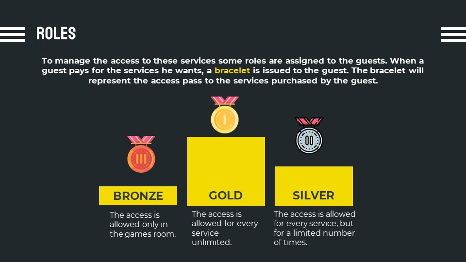
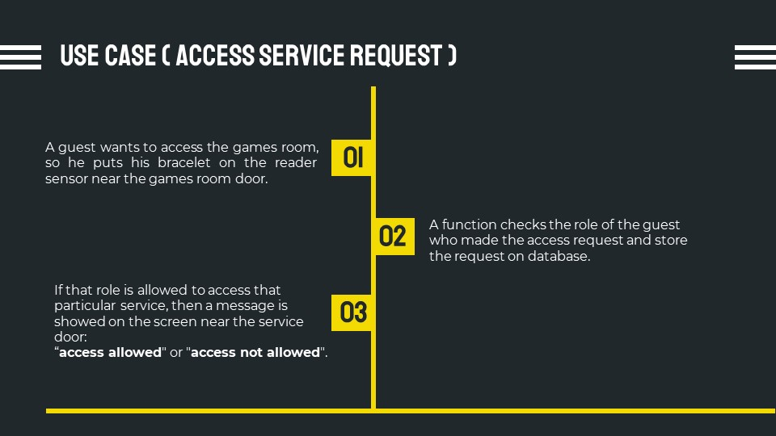
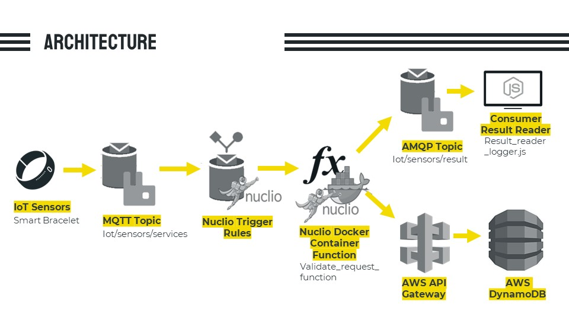

| Building Access Management | Nicola De Cristofaro|
| --- | --- |

# Serverless Computing Project: Hotel Service Management
The basic problem that this project aims to solve is the management of all kind of accesses in a building; It can be initially applied to a hotel building scenario, but it can be potentially extended to all buildings that need access management.

This goal is reached in a Serverless way: Serverless Computing is a cloud computing model in which code is run as a service without the need for the user to maintain or create the underlying infrastructure.This doesn’t mean that serverless architecture doesn’t require servers, but instead that a third party is managing these servers instead of the developers.

## Installation process
- We start both Nuclio and RabbitMQ using Docker Container and then we can run on browser the graphical interface to interact with the tools, for example in GUI of Nuclio it is possible to create the project and add serverless function either from scratch or importing them from .yaml file.

- The Android MQTT Client to emulate the IoT Sensor is downloaded from Play Store.

- Finally to launch the node js app that consumes the result show it, it is necessary to install node, then the amqplib and launch the app with node command.

## Project Requisites

In a hotel scenario, in most cases, there are many services available to guests such as spa, games room, gym, and so on. However each guest cannot access each service for free, but each service has its cost.

## Use Case

## IoT Sensors Emulation

To emulate the IoT sensors, in this case the bracelet used as a pass to access the services, it is used a MQTT Client mobile application on Android. The purpose is to emulate the actions of IoT Sensors that send data in order to trigger serverless functions.

## Architecture

- The IoT sensor that send data on MQTT Topic.
- This message triggers a serverless function deployed using Nuclio.
- The function interacts with the database DynamoDB trough AWS API Gateway to get data from DB.
- And finally publish the result on AMQP topic, consumed and showed by a node js application that is the emulation of the screen reader near the door of the service that inform the guest if the access is allowed or not.

## Analytics

- Analytics is the analysis of data or statistics. It is used for the discovery, interpretation, and communication of meaningful patterns in data. Organizations may apply analytics to business data to describe, predict, and improve business performance.

- An analytics function implemented in this project allow to retrieve from database the requests made by guests with a particular role for example Bronze or Silver and focus on some attributes stored with the requests: attemptsNumber and accessesNumber.

- If we find that a user has tried many times to access a hotel service unsuccessful, namely the number of attempts of this user is higher than normal in comparison with number of accesses, this could be an insight that this user wants to obtain a higher level role to access more hotel services.

- In this scenario Promotional ads should be presented to this user in order to increase the potential profit.

